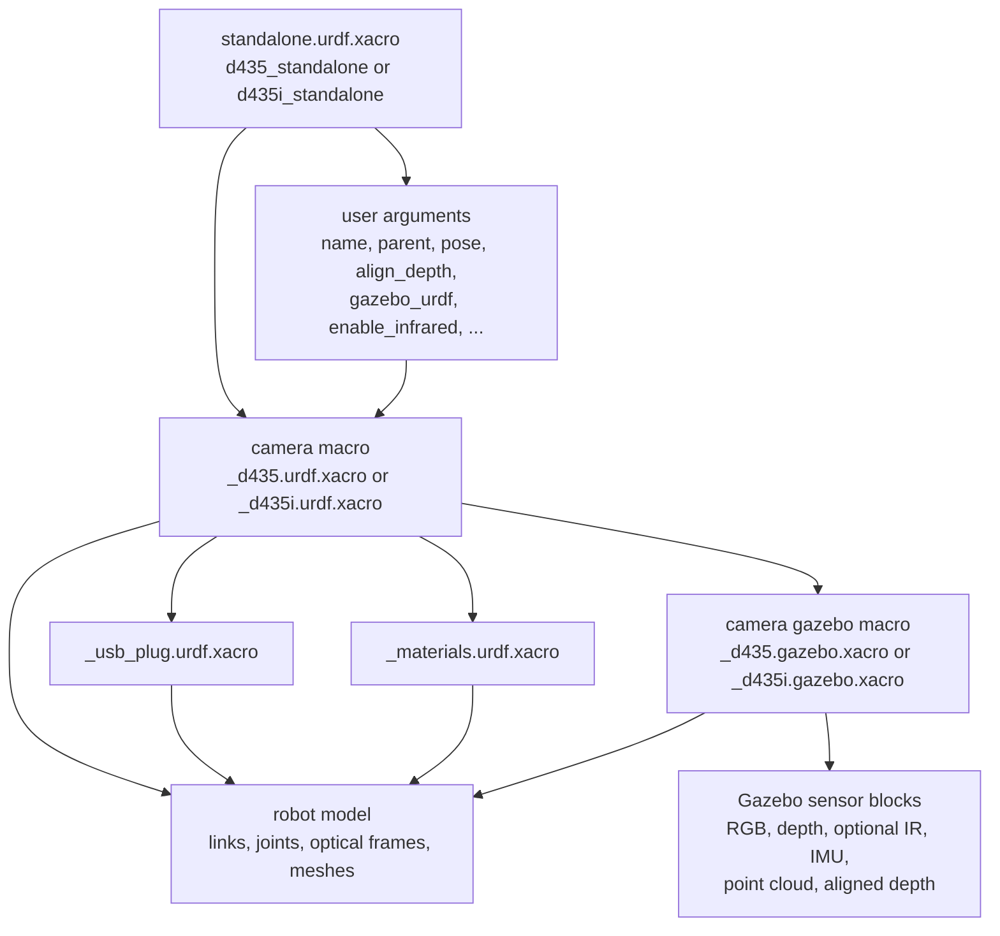

# realsense_gazebo_description

`realsense_gazebo_description` provides URDF/Xacro descriptions and launch files for Intel RealSense D400-family cameras in ROS 2, with special support for visualization in ROS and spawning the camera in Gazebo Sim Harmonic.

For Gazebo simulation, this package depends on the external custom sensor plugin repository:

- `https://github.com/ADVRHumanoids/realsense_gazebo_plugin.git/`

That repository provides the custom Gazebo depth sensor and system plugin referenced by the simulation xacro files.

> [!IMPORTANT]
> The custom Gazebo depth sensor is used to match the ROS 2 pointcloud axis convention. If you do not need that correction, the normal Gazebo sensor path can still be used. The custom path requires `realsense_gazebo_plugin` and the world must load the custom `Ros2CameraSystem` plugin.

## Repository Structure

The package is organized around a few folders that external users will touch most often:

```text
realsense_gazebo_description/
├── launch/
│   ├── view_d435.launch.py
│   ├── view_d435i.launch.py
│   ├── load_d435_gazebo.launch.py
│   ├── load_d435i_gazebo.launch.py
│   ├── view_model.launch.py
│   └── launch_utils.py
├── urdf/
│   ├── d435_standalone.urdf.xacro
│   ├── d435i_standalone.urdf.xacro
│   ├── _d435.urdf.xacro
│   ├── _d435i.urdf.xacro
│   ├── _d435.gazebo.xacro
│   ├── _d435i.gazebo.xacro
│   ├── _d435_gazebo_config.xacro
│   ├── _materials.urdf.xacro
│   └── _usb_plug.urdf.xacro
├── meshes/
├── rviz/
│   └── d435i.rviz
├── worlds/
│   └── empty.sdf
├── package.xml
└── CMakeLists.txt
```

## Scope of This Package

This package is an asset and launch package. Its job is to provide:

- Xacro and URDF descriptions for the `D435` and `D435i` cameras.
- Gazebo-specific sensor definitions for simulation.
- Launch files to either:
  - visualize the model in ROS 2, or
  - load the model into Gazebo Sim and bridge the sensor topics back to ROS 2.

For simulation, it is meant to be used together with Gazebo/ROS-Gazebo integration packages such as `ros_gz_sim`, `ros_gz_bridge`, and `ros_gz_image`, plus `realsense_gazebo_plugin` for the custom depth sensor.<br>
See [Gazebo Harmonic](https://gazebosim.org/docs/harmonic/install/), [Harmonic/ROS 2 Jazzy](https://gazebosim.org/docs/harmonic/ros_installation/) and [realsense_gazebo_plugin](https://github.com/ADVRHumanoids/realsense_gazebo_plugin.git/) for the installation instructions.

## How the Xacro Files Are Organized

The Xacro stack is split into entry points and reusable internal macros.

### Macro inclusion diagram

The inclusion chain is intentionally layered. A standalone model includes one camera macro, and that camera macro pulls in shared assets plus the Gazebo-specific macro when simulation support is enabled.



### Entry-point Xacro files

These are the files external users will normally reference first:

- `urdf/d435_standalone.urdf.xacro`
- `urdf/d435i_standalone.urdf.xacro`

Each standalone file:

- declares user-facing arguments such as camera name, parent frame, pose, depth alignment, Gazebo enablement, and infrared enablement,
- includes the corresponding internal camera macro,
- instantiates the camera under a parent link, usually `world`,
- can optionally inject Gazebo sensor blocks when `gazebo_urdf:=true`.

Both standalone entry points expose `custom_intrinsic:=true|false` and `use_intrinsic:=true|false`.

- `custom_intrinsic:=false` keeps the preset resolution-based intrinsics from `_d435_gazebo_config.xacro`.
- `custom_intrinsic:=true` uses the explicit `fx/fy/cx/cy` values passed by the user.
- `use_intrinsic:=false` keeps the Gazebo sensor block minimal and does not emit `<lens>` / `<intrinsics>`.
- `use_intrinsic:=true` writes the selected intrinsic values into the Gazebo sensor XML.

By default the custom intrinsic path is not used.

The resolved intrinsics come from the resolution tables in `_d435_gazebo_config.xacro`. Those values were collected from real RealSense calibration data and then mapped to the supported image resolutions used in simulation.

> [!CAUTION]
> These intrinsics were used for simulation tests, but the resulting pointcloud did not match the robot description and the surrounding world object positions closely enough for the default setup. For that reason pointcloud publication and aligned depth are disabled by default, and they must be enabled explicitly if you need them.

For example, [d435i_standalone.urdf.xacro](/home/user/xbot2_ws/src/realsense_gazebo_description/urdf/d435i_standalone.urdf.xacro:1) is the main entry point used by the D435i launch files.

### Internal camera macros

These files define the actual camera structure:

- `urdf/_d435.urdf.xacro`
- `urdf/_d435i.urdf.xacro`

They contain:

- the camera body links and joints,
- optical frames,
- optional infrared frames,
- IMU frames for the D435i,
- optional USB plug geometry,
- the hook that includes Gazebo sensor definitions when requested.

These files are the exact replica of the one present in the [realsense2_description package](https://github.com/realsenseai/realsense-ros/tree/ros2-master/realsense2_description) created by Realsense.<br>
Additionally, they include the gazebo sensors macro when `gazebo_urdf:=true`. For instance, [_d435i.urdf.xacro](/home/user/xbot2_ws/src/realsense_gazebo_description/urdf/_d435i.urdf.xacro:1) defines the `sensor_d435i` macro, resolves D435i Gazebo intrinsics through `_d435_gazebo_config.xacro`, and conditionally includes Gazebo simulation blocks through `_d435i.gazebo.xacro`.

### Gazebo-specific macros

These files describe the simulated sensors:

- `urdf/_d435.gazebo.xacro`
- `urdf/_d435i.gazebo.xacro`

They add Gazebo sensor definitions for:

- RGB camera,
- depth camera,
- optional infrared cameras,
- IMU streams,
- optional aligned depth behavior,

These Gazebo blocks are only added when the standalone or internal macro is called with:

```xml
gazebo_urdf:=true
```

### Depth alignment model

Depth alignment is controlled entirely in the Gazebo Xacro layer, not by a separate ROS post-processing node.

When `align_depth:=false`:

- the custom depth sensor is attached to `depth_frame`,
- the topic is published as `depth/image_raw`,
- the sensor uses the depth camera frame, depth intrinsics, and depth optical frame.

When `align_depth:=true`:

- the custom depth sensor is attached to `color_frame`,
- the topic is published as `aligned_depth_to_color/image_raw`,
- the sensor uses the color camera frame, color intrinsics, and color optical frame,
- the reported camera info topic becomes `aligned_depth_to_color/camera_info`.

In both cases the actual rendered depth stream still comes from the custom `Ros2DepthCamera` implementation. The difference is the reference frame and intrinsics used for the rendered depth image.

### Shared support files

The following files are reused by the camera macros:

- `urdf/_materials.urdf.xacro` for materials
- `urdf/_usb_plug.urdf.xacro` for optional plug geometry
- `meshes/` for the camera visual meshes

## Launch Files Overview

The package provides two categories of launch files.

### View launch files: ROS visualization only

- `launch/view_d435.launch.py`
- `launch/view_d435i.launch.py`
- `launch/view_model.launch.py`

Use these when you want to inspect the model in ROS 2 without simulation.
`view_model.launch.py` is the generic version of the viewer: instead of being tied to `D435` or `D435i`, it accepts a `model` argument and loads a xacro file from the package `urdf/` folder. In practice, it is best used with the standalone entry points such as `d435_standalone.urdf.xacro` and `d435i_standalone.urdf.xacro`, not the internal `_*.xacro` helper files.

What they do:

- generate URDF from Xacro,
- run `robot_state_publisher`,
- optionally open RViz,
- optionally publish a static transform from `world` to the camera base frame.

`view_model.launch.py` is a small special case:

- it reads `model:=...` directly from `sys.argv` instead of declaring standard ROS launch arguments,
- it always starts RViz,
- it always starts `robot_state_publisher`.

What they do **not** do:

- they do not start Gazebo,
- they do not spawn simulated sensors,
- they do not bridge Gazebo topics.

### Load launch files: simulation in Gazebo Sim

- `launch/load_d435_gazebo.launch.py`
- `launch/load_d435i_gazebo.launch.py`

Use these when you want the camera to exist inside Gazebo Sim as a simulated sensor.

What they do:

- start Gazebo Sim,
- generate the robot description from Xacro,
- spawn the model in simulation,
- bridge sensor streams from Gazebo to ROS 2,
- optionally enable RViz,
- support options such as:
  - `align_depth`
  - `publish_pointcloud`
  - `enable_infrared`
  - pose and naming arguments

The simulation launchers use both Gazebo bridge stacks:

- `ros_gz_image` for the RGB image topic,
- `ros_gz_bridge` for camera info, depth, point cloud, infrared, and IMU topics.


## Launch Arguments

The package exposes two main launch patterns: ROS-only view launchers and Gazebo loading launchers.

### Arguments for the view launch files

`view_d435.launch.py` and `view_d435i.launch.py` expose the same arguments:

- `use_sim_time` default: `true`
  Controls whether ROS nodes use simulation time.
- `rviz` default: `false`
  Opens RViz with the package configuration when set to `true`.
- `robot_state_publisher` default: `true`
  Starts `robot_state_publisher` for the selected camera model.
- `pub_world_tf` default: `false`
  Publishes a static transform from `world` to the camera bottom screw frame.
- `pose_x` default: `0.0`
  X position used by the optional static transform.
- `pose_y` default: `0.0`
  Y position used by the optional static transform.
- `pose_z` default: `0.0`
  Z position used by the optional static transform.
- `pose_roll` default: `0.0`
  Roll used by the optional static transform.
- `pose_pitch` default: `0.0`
  Pitch used by the optional static transform.
- `pose_yaw` default: `0.0`
  Yaw used by the optional static transform.

### Arguments for the generic view launch file

`view_model.launch.py` is the generic viewer. It does not declare ROS launch arguments in the same way as the other two view launchers. Instead, it expects:

- `model`
  Required command-line parameter. It must match one file name present in `urdf/`.

Notes:

- the file is selected by name, so internal helper xacros may appear in the accepted list even though they are not useful entry points,
- RViz and `robot_state_publisher` are always launched by this file,
- the recommended values for `model` are `d435_standalone.urdf.xacro` and `d435i_standalone.urdf.xacro`.

Example:

```bash
ros2 launch realsense_gazebo_description view_model.launch.py model:=d435i_standalone.urdf.xacro
```

### Arguments for the Gazebo load launch files

`load_d435_gazebo.launch.py` and `load_d435i_gazebo.launch.py` expose the same arguments:

- `name` default: `D435_camera` or `D435i_camera`
  Name of the spawned camera instance and namespace root for topics.
- `parent` default: `world`
  Parent frame used when generating the model.
- `use_sim_time` default: `true`
  Controls whether ROS nodes use simulation time.
- `rviz` default: `false`
  Opens RViz together with the simulation launch.
- `robot_state_publisher` default: `true`
  Starts `robot_state_publisher` with the generated robot description.
- `pose_x` default: `0.0`
  X coordinate passed to the standalone xacro.
- `pose_y` default: `0.0`
  Y coordinate passed to the standalone xacro.
- `pose_z` default: `0.0`
  Z coordinate passed to the standalone xacro.
- `pose_roll` default: `0.0`
  Roll passed to the standalone xacro.
- `pose_pitch` default: `0.0`
  Pitch passed to the standalone xacro.
- `pose_yaw` default: `0.0`
  Yaw passed to the standalone xacro.
- `world_file` default: `worlds/empty.sdf`
  Gazebo world loaded by `ros_gz_sim`.
- `publish_pointcloud` default: `false`
  Enables pointcloud publication in the custom Gazebo depth sensor path. When `false`, the `/points` topic is not created and there is nothing to bridge to ROS 2.
- `align_depth` default: `false`
  Switches depth output to aligned-depth-to-color topics.
- `gazebo_urdf` default: `true`
  Includes Gazebo sensor blocks in the expanded xacro/URDF.
- `enable_infrared` default: `false`
  Enables infrared sensors and the related ROS-Gazebo bridges.

The D435 and D435i standalone xacros also support:

- `custom_intrinsic` default: `false`
  When `false`, the Gazebo intrinsics are derived from the selected image resolutions through `_d435_gazebo_config.xacro`. When `true`, the supplied intrinsic values are used directly.
- `use_intrinsic` default: `false`
  When `true`, the chosen intrinsic values are written into the Gazebo sensor XML. When `false`, the sensor block uses the minimal camera configuration (default).

By default `publish_pointcloud:=false` and `align_depth:=false`. That matches the safer simulation setup used in this workspace.

## Typical Usage

### Visualize the D435i in ROS 2

```bash
ros2 launch realsense_gazebo_description view_d435i.launch.py rviz:=true
```

### Visualize the D435 in ROS 2

```bash
ros2 launch realsense_gazebo_description view_d435.launch.py rviz:=true
```

### Visualize a standalone model with the generic viewer

```bash
ros2 launch realsense_gazebo_description view_model.launch.py model:=d435i_standalone.urdf.xacro
```

### Spawn the D435i in Gazebo Sim

```bash
ros2 launch realsense_gazebo_description load_d435i_gazebo.launch.py
```

### Spawn the D435i in Gazebo Sim with aligned depth and point cloud bridging

```bash
ros2 launch realsense_gazebo_description load_d435i_gazebo.launch.py \
  align_depth:=true \
  publish_pointcloud:=true
```

### Spawn the D435 in Gazebo Sim

```bash
ros2 launch realsense_gazebo_description load_d435_gazebo.launch.py
```

## Main Launch Arguments

The launch files expose a similar set of arguments. The most important ones are:

- `name`: camera instance name
- `parent`: parent frame, usually `world`
- `pose_x`, `pose_y`, `pose_z`: camera position
- `pose_roll`, `pose_pitch`, `pose_yaw`: camera orientation
- `rviz`: open RViz when supported by the launch file
- `robot_state_publisher`: start `robot_state_publisher`
- `world_file`: Gazebo world to load in simulation launch files
- `align_depth`: publish depth aligned to the color camera
- `publish_pointcloud`: enable pointcloud publication in the custom depth sensor path
- `enable_infrared`: enable infrared camera topics in simulation
- `gazebo_urdf`: include Gazebo sensor blocks in the URDF/Xacro expansion
- `custom_intrinsic`: bypass resolution-based intrinsic selection and use explicit intrinsic values
- `use_intrinsic`: write the selected intrinsic values into the Gazebo sensor XML

## External Usage Notes

For external users, the recommended mental model is:

1. Start from the standalone Xacro for the camera model you need.
2. Use a `view_*` launch file if you only want ROS-side visualization and TF publication.
3. Use a `load_*_gazebo` launch file if you want the camera spawned as a simulated Gazebo sensor.

If you want to reuse the model in another robot description, the most common pattern is:

- include `d435_standalone.urdf.xacro` or `d435i_standalone.urdf.xacro`,
- attach it to your robot with a custom `parent` and pose,
- keep `gazebo_urdf:=false` for pure URDF/TF usage,
- set `gazebo_urdf:=true` when the model must carry Gazebo sensor definitions for simulation.

For the sensor implementation details, pointcloud handling, and system-plugin behavior, see the companion package README in `realsense_gazebo_plugin`.

>**NOTE:**
> In simulation, RGB images are bridged with `ros_gz_image`, while camera info, depth, point clouds, infrared, and IMU topics are bridged with `ros_gz_bridge`.

## Dependencies

At runtime, this package expects the usual ROS 2 description tooling, visualization nodes, and Gazebo integration packages when simulation launch files are used:

- `xacro`
- `rviz2`
- `robot_state_publisher`
- `tf2_ros`
- `ros_gz_sim`
- `ros_gz_bridge`
- `ros_gz_image`
- `realsense_gazebo_plugin`
- Gazebo Harmonic
- ROS 2 Jazzy
- `realsense2_camera_msgs`
