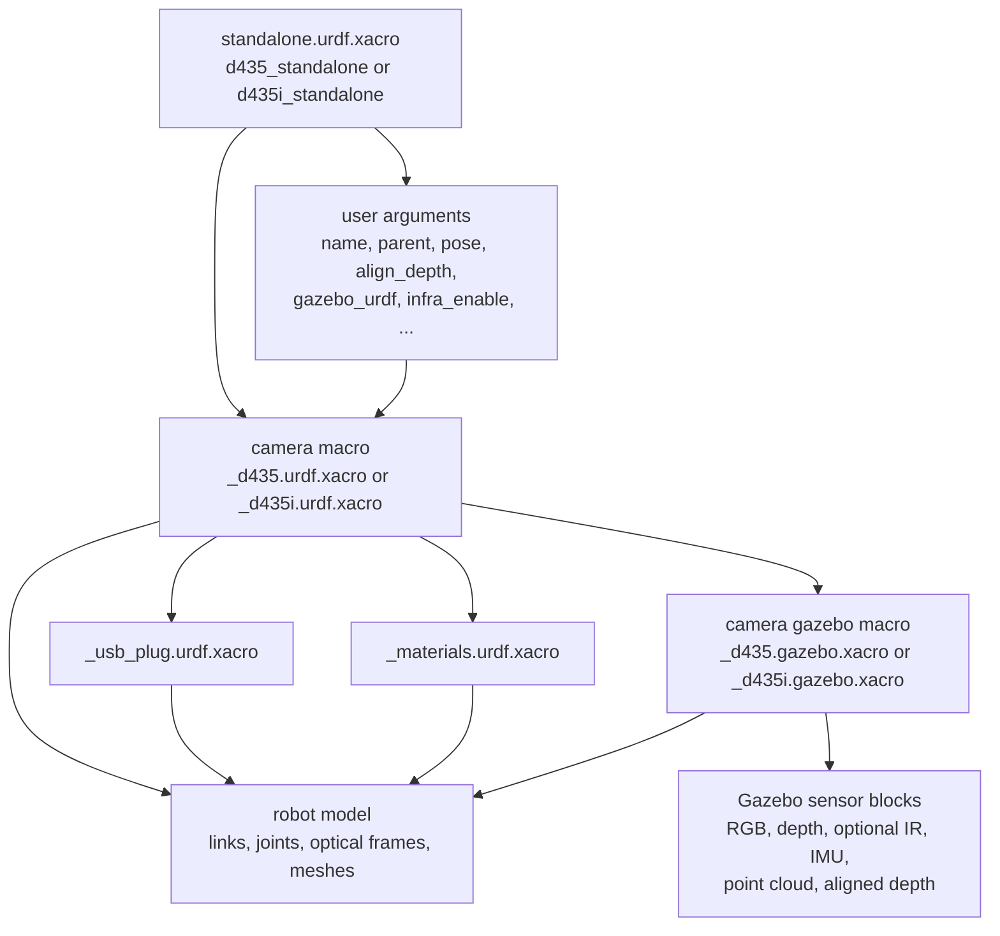

# realsense_gazebo_description

`realsense_gazebo_description` provides URDF/Xacro descriptions and launch files for Intel RealSense D400-family cameras in ROS 2, with special support for visualization in ROS and spawning the camera in Gazebo Sim Harmonic.

## Repository Structure

The package is organized around a few folders that external users will touch most often:

```text
realsense_gazebo_description/
├── launch/
│   ├── view_d435.launch.py
│   ├── view_d435i.launch.py
│   ├── load_d435_gazebo.launch.py
│   ├── load_d435i_gazebo.launch.py
│   ├── view_model.launch.py
│   └── launch_utils.py
├── urdf/
│   ├── d435_standalone.urdf.xacro
│   ├── d435i_standalone.urdf.xacro
│   ├── _d435.urdf.xacro
│   ├── _d435i.urdf.xacro
│   ├── _d435.gazebo.xacro
│   ├── _d435i.gazebo.xacro
│   ├── _d435_gazebo_config.xacro
│   ├── _materials.urdf.xacro
│   └── _usb_plug.urdf.xacro
├── meshes/
├── rviz/
│   └── d435i.rviz
├── worlds/
│   └── empty.sdf
├── package.xml
└── CMakeLists.txt
```

## Scope of This Package

This package is an asset and launch package. Its job is to provide:

- Xacro and URDF descriptions for the `D435` and `D435i` cameras.
- Gazebo-specific sensor definitions for simulation.
- Launch files to either:
  - visualize the model in ROS 2, or
  - load the model into Gazebo Sim and bridge the sensor topics back to ROS 2.

For simulation, it is meant to be used together with Gazebo/ROS-Gazebo integration packages such as `ros_gz_sim`, `ros_gz_bridge`, and `ros_gz_image`.<br>
See [Gazebo Harmonic](https://gazebosim.org/docs/harmonic/install/) and [Harmonic/ROS 2 Jazzy](https://gazebosim.org/docs/harmonic/ros_installation/) for the installation instructions.

## How the Xacro Files Are Organized

The Xacro stack is split into entry points and reusable internal macros.

### Macro inclusion diagram

The inclusion chain is intentionally layered. A standalone model includes one camera macro, and that camera macro pulls in shared assets plus the Gazebo-specific macro when simulation support is enabled.



### Entry-point Xacro files

These are the files external users will normally reference first:

- `urdf/d435_standalone.urdf.xacro`
- `urdf/d435i_standalone.urdf.xacro`

Each standalone file:

- declares user-facing arguments such as camera name, parent frame, pose, depth alignment, and Gazebo enablement,
- includes the corresponding internal camera macro,
- instantiates the camera under a parent link, usually `world`,
- can optionally inject Gazebo sensor blocks when `gazebo_urdf:=true`.

For example, [d435i_standalone.urdf.xacro](/home/user/xbot2_ws/src/realsense_gazebo_description/urdf/d435i_standalone.urdf.xacro:1) is the main entry point used by the D435i launch files.

### Internal camera macros

These files define the actual camera structure:

- `urdf/_d435.urdf.xacro`
- `urdf/_d435i.urdf.xacro`

They contain:

- the camera body links and joints,
- optical frames,
- optional infrared frames,
- IMU frames for the D435i,
- optional USB plug geometry,
- the hook that includes Gazebo sensor definitions when requested.

These files are the exact replica of the one present in the [realsense2_description package](https://github.com/realsenseai/realsense-ros/tree/ros2-master/realsense2_description) created by Realsense.<br>
Additionally, they include the gazebo sensors macro when `gazebo_urdf:=true`. For instance, [_d435i.urdf.xacro](/home/user/xbot2_ws/src/realsense_gazebo_description/urdf/_d435i.urdf.xacro:1) defines the `sensor_d435i` macro and conditionally includes Gazebo simulation blocks through `_d435i.gazebo.xacro`.

### Gazebo-specific macros

These files describe the simulated sensors:

- `urdf/_d435.gazebo.xacro`
- `urdf/_d435i.gazebo.xacro`

They add Gazebo sensor definitions for:

- RGB camera,
- depth camera,
- optional infrared cameras,
- IMU streams,
- optional aligned depth behavior,

These Gazebo blocks are only added when the standalone or internal macro is called with:

```xml
gazebo_urdf:=true
```

### Shared support files

The following files are reused by the camera macros:

- `urdf/_materials.urdf.xacro` for materials
- `urdf/_usb_plug.urdf.xacro` for optional plug geometry
- `meshes/` for the camera visual meshes

## Launch Files Overview

The package provides two categories of launch files.

### View launch files: ROS visualization only

- `launch/view_d435.launch.py`
- `launch/view_d435i.launch.py`
- `launch/view_model.launch.py`

Use these when you want to inspect the model in ROS 2 without simulation.
`view_model.launch.py` is the generic version of the viewer: instead of being tied to `D435` or `D435i`, it accepts a `model` argument and loads any xacro file available in the package `urdf/` folder.

What they do:

- generate URDF from Xacro,
- run `robot_state_publisher`,
- optionally open RViz,
- optionally publish a static transform from `world` to the camera base frame.

What they do **not** do:

- they do not start Gazebo,
- they do not spawn simulated sensors,
- they do not bridge Gazebo topics.

### Load launch files: simulation in Gazebo Sim

- `launch/load_d435_gazebo.launch.py`
- `launch/load_d435i_gazebo.launch.py`

Use these when you want the camera to exist inside Gazebo Sim as a simulated sensor.

What they do:

- start Gazebo Sim,
- generate the robot description from Xacro,
- spawn the model in simulation,
- bridge sensor streams from Gazebo to ROS 2,
- optionally enable RViz,
- support options such as:
  - `align_depth`
  - `publish_pointcloud`
  - `infra_enable`
  - pose and naming arguments


## Launch Arguments

The package exposes two main launch patterns: ROS-only view launchers and Gazebo loading launchers.

### Arguments for the view launch files

`view_d435.launch.py` and `view_d435i.launch.py` expose the same arguments:

- `use_sim_time` default: `true`
  Controls whether ROS nodes use simulation time.
- `rviz` default: `false`
  Opens RViz with the package configuration when set to `true`.
- `robot_state_publisher` default: `true`
  Starts `robot_state_publisher` for the selected camera model.
- `pub_world_tf` default: `false`
  Publishes a static transform from `world` to the camera bottom screw frame.
- `pose_x` default: `0.0`
  X position used by the optional static transform.
- `pose_y` default: `0.0`
  Y position used by the optional static transform.
- `pose_z` default: `0.0`
  Z position used by the optional static transform.
- `pose_roll` default: `0.0`
  Roll used by the optional static transform.
- `pose_pitch` default: `0.0`
  Pitch used by the optional static transform.
- `pose_yaw` default: `0.0`
  Yaw used by the optional static transform.

### Arguments for the generic view launch file

`view_model.launch.py` is the generic viewer. It does not declare ROS launch arguments in the same way as the other two view launchers. Instead, it expects:

- `model`
  Required command-line parameter. It must match one file name present in `urdf/`.

Example:

```bash
ros2 launch realsense_gazebo_description view_model.launch.py model:=d435i_standalone.urdf.xacro
```

### Arguments for the Gazebo load launch files

`load_d435_gazebo.launch.py` and `load_d435i_gazebo.launch.py` expose the same arguments:

- `name` default: `D435_camera` or `D435i_camera`
  Name of the spawned camera instance and namespace root for topics.
- `parent` default: `world`
  Parent frame used when generating the model.
- `use_sim_time` default: `true`
  Controls whether ROS nodes use simulation time.
- `rviz` default: `false`
  Opens RViz together with the simulation launch.
- `robot_state_publisher` default: `true`
  Starts `robot_state_publisher` with the generated robot description.
- `pose_x` default: `0.0`
  X coordinate passed to the standalone xacro.
- `pose_y` default: `0.0`
  Y coordinate passed to the standalone xacro.
- `pose_z` default: `0.0`
  Z coordinate passed to the standalone xacro.
- `pose_roll` default: `0.0`
  Roll passed to the standalone xacro.
- `pose_pitch` default: `0.0`
  Pitch passed to the standalone xacro.
- `pose_yaw` default: `0.0`
  Yaw passed to the standalone xacro.
- `world_file` default: `worlds/empty.sdf`
  Gazebo world loaded by `ros_gz_sim`.
- `publish_pointcloud` default: `false`
  Enables bridging the point cloud topic from Gazebo to ROS 2.
- `align_depth` default: `false`
  Switches depth output to aligned-depth-to-color topics.
- `gazebo_urdf` default: `true`
  Includes Gazebo sensor blocks in the expanded xacro/URDF.
- `infra_enable` default: `false`
  Enables infrared sensors and the related ROS-Gazebo bridges.

## Typical Usage

### Visualize the D435i in ROS 2

```bash
ros2 launch realsense_gazebo_description view_d435i.launch.py rviz:=true
```

### Visualize the D435 in ROS 2

```bash
ros2 launch realsense_gazebo_description view_d435.launch.py rviz:=true
```

### Visualize any available model with the generic viewer

```bash
ros2 launch realsense_gazebo_description view_model.launch.py model:=d435i_standalone.urdf.xacro
```

### Spawn the D435i in Gazebo Sim

```bash
ros2 launch realsense_gazebo_description load_d435i_gazebo.launch.py
```

### Spawn the D435i in Gazebo Sim with aligned depth and point cloud bridging

```bash
ros2 launch realsense_gazebo_description load_d435i_gazebo.launch.py \
  align_depth:=true \
  publish_pointcloud:=true
```

### Spawn the D435 in Gazebo Sim

```bash
ros2 launch realsense_gazebo_description load_d435_gazebo.launch.py
```

## Main Launch Arguments

The launch files expose a similar set of arguments. The most important ones are:

- `name`: camera instance name
- `parent`: parent frame, usually `world`
- `pose_x`, `pose_y`, `pose_z`: camera position
- `pose_roll`, `pose_pitch`, `pose_yaw`: camera orientation
- `rviz`: open RViz when supported by the launch file
- `robot_state_publisher`: start `robot_state_publisher`
- `world_file`: Gazebo world to load in simulation launch files
- `align_depth`: publish depth aligned to the color camera
- `publish_pointcloud`: bridge the point cloud topic to ROS 2
- `infra_enable`: enable infrared camera topics in simulation
- `gazebo_urdf`: include Gazebo sensor blocks in the URDF/Xacro expansion

>**NOTE:**
> `publish_pointcloud` only removes the bridge from Gazebo to ROS 2 of the topic. In Gazebo the topic is always published.

## External Usage Notes

For external users, the recommended mental model is:

1. Start from the standalone Xacro for the camera model you need.
2. Use a `view_*` launch file if you only want ROS-side visualization and TF publication.
3. Use a `load_*_gazebo` launch file if you want the camera spawned as a simulated Gazebo sensor.

If you want to reuse the model in another robot description, the most common pattern is:

- include `d435_standalone.urdf.xacro` or `d435i_standalone.urdf.xacro`,
- attach it to your robot with a custom `parent` and pose,
- keep `gazebo_urdf:=false` for pure URDF/TF usage,
- set `gazebo_urdf:=true` when the model must carry Gazebo sensor definitions for simulation.

>**NOTE:**
> The topic from the simulation are bridged to ROS 2 frfom Gazebo Harmonic via the proper bridge.
> See the launch file to understand how to do it.

## Dependencies

At runtime, this package expects the usual ROS 2 description tooling plus Gazebo integration packages when simulation launch files are used:

- `xacro`
- Gazebo Harmonic
- ROS 2 Jazzy
- realsense2_camera_msgs

